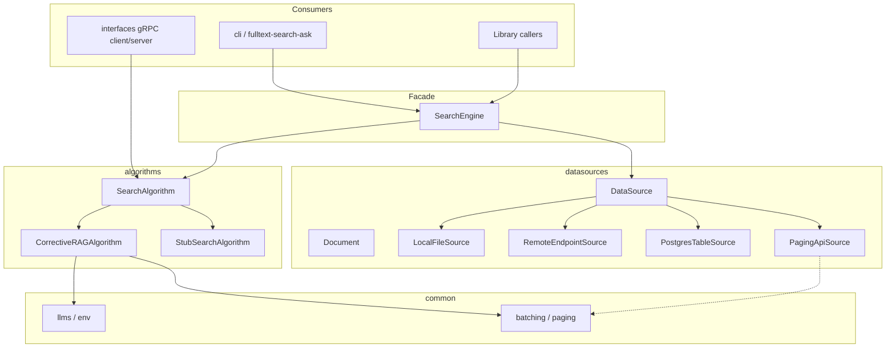
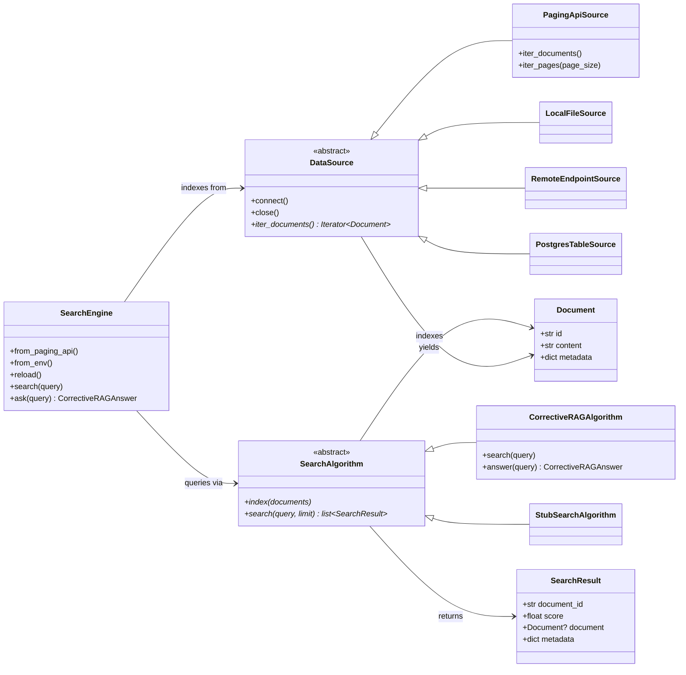

# fulltext-search

Clearsky's Python package for full-text search over arbitrary data sources, with a gRPC API.

## Install from GitHub

```bash
pip install git+https://github.com/cs-ahmed-salem/full-text-search.git
```

Editable / development install:

```bash
git clone https://github.com/cs-ahmed-salem/full-text-search.git
cd full-text-search
pip install -e ".[dev]"
```

Pin a branch, tag, or commit:

```bash
pip install git+https://github.com/cs-ahmed-salem/full-text-search.git@main
```

## Architecture

Core idea: **data sources** yield `Document`s, **algorithms** index and search
them, and **`SearchEngine`** wires the two. Optional **gRPC** and **CLI** sit on
top of the same abstractions.





| Package | Responsibility |
| --- | --- |
| `datasources` | Connectors that stream `Document`s (`LocalFileSource`, `RemoteEndpointSource`, `PostgresTableSource`, `PagingApiSource`) |
| `algorithms` | `SearchAlgorithm` implementations — notably [Corrective RAG](src/fulltext_search/algorithms/CORRECTIVE_RAG.md) |
| `engine` | High-level facade: load a source, index into an algorithm, `ask` / `search` |
| `common` | LLM config, env loading, document batching / paging helpers |
| `interfaces` | gRPC proto, server, and client |
| `cli` | `fulltext-search-ask` entry point |

## Layout

```
src/fulltext_search/
  algorithms/     # SearchAlgorithm implementations (Corrective RAG, stub)
  datasources/    # local files, remote endpoints, Postgres, paging HTTP API
  common/         # LLM config, env helpers, batching
  interfaces/     # gRPC API (proto, server, client)
  engine.py       # SearchEngine facade
  cli.py          # fulltext-search-ask
tests/
  algorithms/
  datasources/
  interfaces/
  performance/
```

## Quick start (library)

```python
from fulltext_search import SearchEngine

engine = SearchEngine.from_env()  # FULLTEXT_SEARCH_API_URL / _PASS from .env
result = engine.ask("my question", top_k=5)
for record in result.records:
    print(record.id, record.metadata.get("title"))
```

Or wire pieces explicitly:

```python
from fulltext_search import (
    CorrectiveRAGAlgorithm,
    PagingApiSource,
    SearchEngine,
)

engine = SearchEngine(
    PagingApiSource(url, headers={"x-internal-pass": "..."}),
    CorrectiveRAGAlgorithm(),
)
hits = engine.search("my question", top_k=5)
```

### Pageable brute-force search

For a multithreaded brute-force scan over the whole corpus (grade every
document, keep only `relevant` records, ranked with reasoning), use the
pageable API. Results are persisted to a temp-file session so you can page
through them without re-running the LLM grading:

```python
first = engine.search_all("my question", page=0, size=20)
print(first.total_elements, first.total_pages, first.last)
for hit in first.content:
    print(hit.document_id, hit.metadata["relevance"], hit.metadata["rationale"])

next_page = engine.get_search_page(first.session_id, page=1, size=20)
```

## gRPC interface

Start a server (uses the temporary stub algorithm until real ones land):

```bash
fulltext-search-serve --port 50051
```

Or programmatically:

```python
from fulltext_search.algorithms.stub import StubSearchAlgorithm
from fulltext_search.interfaces import FullTextSearchClient, serve

# server process
serve(StubSearchAlgorithm(), port=50051)

# client process
with FullTextSearchClient("localhost:50051") as client:
    client.index([])  # documents
    hits = client.search("query", limit=10)
```

To expose the pageable brute-force RPCs (`CreateFullSearch` / `GetSearchPage`),
serve with an engine:

```python
from fulltext_search import SearchEngine
from fulltext_search.interfaces import serve

engine = SearchEngine.from_env()
serve(engine.algorithm, port=50051, engine=engine)

# client process
with FullTextSearchClient("localhost:50051") as client:
    page = client.create_full_search("query", page=0, size=20)
    more = client.get_search_page(page.session_id, page=1, size=20)
```

Regenerate stubs after editing the proto:

```bash
python scripts/generate_protos.py
```

## Corrective RAG (DSPy)

`CorrectiveRAGAlgorithm` implements scalable Corrective RAG on DSPy: map-reduce
lexical recall, LLM relevance grading, and a corrective query rewrite when
retrieval is weak. It returns **graded search hits only** (no answer
generation).

Full write-up: [`algorithms/CORRECTIVE_RAG.md`](src/fulltext_search/algorithms/CORRECTIVE_RAG.md).

Configure the LLM via environment variables (no secrets in code):

```bash
export FULLTEXT_SEARCH_LM="openai/gpt-4o-mini"   # default
export OPENAI_API_KEY="sk-..."                    # provider key used by dspy.LM
```

```python
from fulltext_search.algorithms import CorrectiveRAGAlgorithm
from fulltext_search.datasources import Document

algo = CorrectiveRAGAlgorithm(batch_size=256, max_workers=8)
algo.index([Document(id="1", content="...")])

hits = algo.search("my question", limit=5)
result = algo.answer("my question", top_k=5)
print(result.records, result.rewritten_query)
```

It implements `SearchAlgorithm`, so it can be served over gRPC:
`serve(CorrectiveRAGAlgorithm(), port=50051)`.

## Test

```bash
pytest
pytest -m performance
```

The Corrective RAG evaluation on the task dataset
(`tests/algorithms/test_corrective_rag_eval.py`) is a live-LLM test excluded
from the default run. It skips when no credentials are available. Run it with:

```bash
pytest -m evaluation
```

Or run the same evaluation as a CLI report (with tunable knobs):

```bash
python scripts/eval_corrective_rag.py --num-queries 15 --limit 5
```
