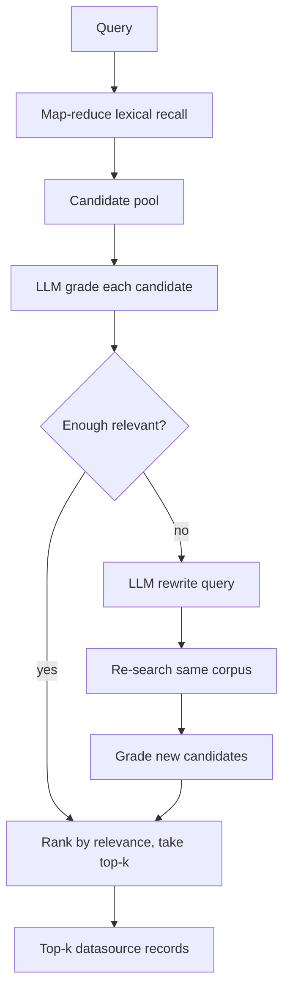

# Corrective RAG

This package implements a **retrieval-only** Corrective RAG (CRAG) pipeline on
top of [DSPy](https://dspy.ai/). It follows the corrective retrieval idea from
[Meilisearch's Corrective RAG overview](https://www.meilisearch.com/blog/corrective-rag):
retrieve candidates, grade them for relevance, and rewrite the query when
retrieval is weak — then return ranked hits. **No answer is generated**; the
LLM is used only for grading and query rewrite.

## Pipeline



| Stage | What happens | Where |
| --- | --- | --- |
| **Retrieve** | Score document pages in parallel with a lexical scorer; keep a reduced candidate pool | `map_reduce.map_reduce_retrieve` |
| **Grade** | LLM labels each candidate `relevant` / `ambiguous` / `irrelevant` | `GradeDocument` + `CorrectiveRAGModule.grade_candidates` |
| **Correct** | If fewer than `min_relevant` docs are `relevant`, rewrite the query and retrieve+grade again | `RewriteQuery` + `correct_and_retrieve` |
| **Rank** | Sort all graded candidates by relevance weight, then lexical score; return top-k datasource records | `_rank_graded` / `_to_answer` |

## Why map-reduce?

The corpus can be large. Instead of scoring every document on one thread, pages
of documents are scored concurrently (`max_workers`). Each page keeps a local
top-`k` (`recall_per_batch`); a reduce step merges them into the global
candidate pool (`candidate_pool`). The LLM never sees the full corpus — only
that small pool.

## Relevance grades

| Grade | Weight | Rank effect |
| --- | --- | --- |
| `relevant` | 1.0 | highest |
| `ambiguous` | 0.5 | middle |
| `irrelevant` | 0.0 | lowest (still eligible if top-k is large enough) |

Grades become `SearchResult.score`. Metadata on each hit includes `relevance`,
`rationale`, and `lexical_score`. The paired `records` list holds the indexed
datasource `Document`s for those hits.

## Public API

```python
from fulltext_search.algorithms import CorrectiveRAGAlgorithm
from fulltext_search.datasources import Document

algo = CorrectiveRAGAlgorithm(
    batch_size=256,       # page size for map-reduce
    max_workers=8,        # parallel page scorers
    candidate_pool=20,    # docs sent to the LLM grader
    min_relevant=1,       # rewrite if fewer than this many "relevant"
    grade_workers=4,      # parallel grade calls
)
algo.index([Document(id="1", content="...")])

# Top-k SearchResults (limit == top_k, must be > 0)
hits = algo.search("my question", limit=5)

# Same pipeline: top-k datasource records + rewrite metadata
result = algo.answer("my question", top_k=5)
print(result.rewritten_query)
for record, hit in zip(result.records, result.results):
    print(record.id, record.metadata.get("title"), hit.metadata["relevance"])
```

`search` and `answer` share the same retrieve → grade → correct path.
`answer` returns a `CorrectiveRAGAnswer` with `results`, `records`, and optional
`rewritten_query`; it does **not** generate natural-language answers.
`top_k` must be ``> 0``.

## Brute-force pageable search

`answer_all(query)` runs Corrective RAG as a multithreaded brute-force scan of
the **entire** indexed corpus rather than a reduced candidate pool:

1. **Score all** — `map_reduce.map_reduce_score_all` lexically scores every
   document in parallel pages, keeping even zero-score docs so the LLM sees the
   whole corpus.
2. **Grade all** — every document is graded (`grade_workers` threads).
3. **Correct** — if fewer than `min_relevant` grade `relevant`, the query is
   rewritten once and every not-yet-`relevant` document is re-graded; the better
   grade per document wins.
4. **Filter + rank** — only documents graded `relevant` are kept, ordered by
   lexical score then `document_id`.

Because the whole result set can be large, it is served through a **pageable**
API instead of a top-k list. `SearchEngine.search_all` persists the ranked
results to a temp-file session (`fulltext_search.results.SessionStore`) and
returns a Spring Data-style `SearchPage`:

```python
from fulltext_search import SearchEngine

engine = SearchEngine.from_env()
first = engine.search_all("send email to complete task", page=0, size=20)
print(first.total_elements, first.total_pages, first.last)
for hit in first.content:
    print(hit.document_id, hit.metadata["relevance"], hit.metadata["rationale"])

# Page further without re-running the LLM grading.
second = engine.get_search_page(first.session_id, page=1, size=20)
```

Over gRPC the same flow is exposed by `CreateFullSearch` (returns the first
`PageableSearchResponse` plus a `session_id`) and `GetSearchPage` (fetches
later pages). These RPCs require an engine-backed servicer; otherwise they
return `UNIMPLEMENTED`. An unknown `session_id` returns `NOT_FOUND`.

`SearchPage` fields: `content`, `page`, `size`, `total_elements`,
`total_pages`, `last`, `session_id`, `rewritten_query`.

## Key types

| Type | Role |
| --- | --- |
| `CorrectiveRAGAlgorithm` | `SearchAlgorithm` implementation: index + search |
| `CorrectiveRAGModule` | DSPy module: grade / rewrite predictors |
| `GradeDocument` | DSPy signature for relevance grading |
| `RewriteQuery` | DSPy signature for corrective rewrite |
| `GradedCandidate` | Candidate + grade + rationale |
| `CorrectiveRAGAnswer` | `{results, records, rewritten_query}` |

## LLM configuration

The algorithm uses `fulltext_search.common.llms.configure_default_lm` when no
`lm=` is passed. Typical env vars:

```bash
export FULLTEXT_SEARCH_LM="azure/<deployment>"   # or openai/gpt-4o-mini
export OPENAI_API_KEY="..."                     # or Azure key / AZURE_AD_TOKEN
export AZURE_ENDPOINT="https://...."
export AZURE_API_VERSION="2024-12-01-preview"
```

See `fulltext_search.common.llms` for the full list.

## Evaluation

Live-LLM evaluation against the task corpus:

```bash
pytest -m evaluation
python scripts/eval_corrective_rag.py --num-queries 15 --limit 5
```
