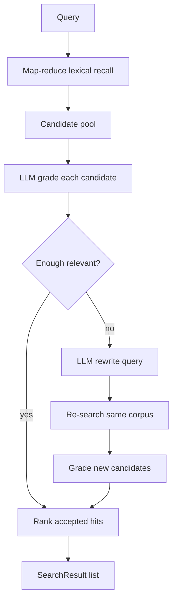

# Corrective RAG

This package implements a **retrieval-only** Corrective RAG (CRAG) pipeline on
top of [DSPy](https://dspy.ai/). It follows the corrective retrieval idea from
[Meilisearch's Corrective RAG overview](https://www.meilisearch.com/blog/corrective-rag):
retrieve candidates, grade them for relevance, and rewrite the query when
retrieval is weak — then return ranked hits. **No answer is generated**; the
LLM is used only for grading and query rewrite.

## Pipeline



| Stage | What happens | Where |
| --- | --- | --- |
| **Retrieve** | Score document pages in parallel with a lexical scorer; keep a reduced candidate pool | `map_reduce.map_reduce_retrieve` |
| **Grade** | LLM labels each candidate `relevant` / `ambiguous` / `irrelevant` | `GradeDocument` + `CorrectiveRAGModule.grade_candidates` |
| **Correct** | If fewer than `min_relevant` docs are `relevant`, rewrite the query and retrieve+grade again | `RewriteQuery` + `correct_and_retrieve` |
| **Rank** | Drop `irrelevant`; sort by relevance weight, then lexical score | `_rank_graded` / `_to_search_results` |

## Why map-reduce?

The corpus can be large. Instead of scoring every document on one thread, pages
of documents are scored concurrently (`max_workers`). Each page keeps a local
top-`k` (`recall_per_batch`); a reduce step merges them into the global
candidate pool (`candidate_pool`). The LLM never sees the full corpus — only
that small pool.

## Relevance grades

| Grade | Weight | Kept in results? |
| --- | --- | --- |
| `relevant` | 1.0 | yes |
| `ambiguous` | 0.5 | yes |
| `irrelevant` | 0.0 | no |

Grades become `SearchResult.score`. Metadata on each hit includes `relevance`,
`rationale`, and `lexical_score`.

## Public API

```python
from fulltext_search.algorithms import CorrectiveRAGAlgorithm
from fulltext_search.datasources import Document

algo = CorrectiveRAGAlgorithm(
    batch_size=256,       # page size for map-reduce
    max_workers=8,        # parallel page scorers
    candidate_pool=20,    # docs sent to the LLM grader
    min_relevant=1,       # rewrite if fewer than this many "relevant"
    grade_workers=4,      # parallel grade calls
)
algo.index([Document(id="1", content="...")])

# Ranked hits only
hits = algo.search("my question", limit=10)

# Same pipeline, plus rewrite metadata
result = algo.answer("my question", limit=10)
print(result.rewritten_query)
for hit in result.results:
    print(hit.document_id, hit.metadata["relevance"], hit.score)
```

`search` and `answer` share the same retrieve → grade → correct path.
`answer` returns a `CorrectiveRAGAnswer` with `results` and optional
`rewritten_query`; it does **not** generate natural-language answers.

## Key types

| Type | Role |
| --- | --- |
| `CorrectiveRAGAlgorithm` | `SearchAlgorithm` implementation: index + search |
| `CorrectiveRAGModule` | DSPy module: grade / rewrite predictors |
| `GradeDocument` | DSPy signature for relevance grading |
| `RewriteQuery` | DSPy signature for corrective rewrite |
| `GradedCandidate` | Candidate + grade + rationale |
| `CorrectiveRAGAnswer` | `{results, rewritten_query}` |

## LLM configuration

The algorithm uses `fulltext_search.common.llms.configure_default_lm` when no
`lm=` is passed. Typical env vars:

```bash
export FULLTEXT_SEARCH_LM="azure/<deployment>"   # or openai/gpt-4o-mini
export OPENAI_API_KEY="..."                     # or Azure key / AZURE_AD_TOKEN
export AZURE_ENDPOINT="https://...."
export AZURE_API_VERSION="2024-12-01-preview"
```

See `fulltext_search.common.llms` for the full list.

## Evaluation

Live-LLM evaluation against the task corpus:

```bash
pytest -m evaluation
python scripts/eval_corrective_rag.py --num-queries 15 --limit 5
```
